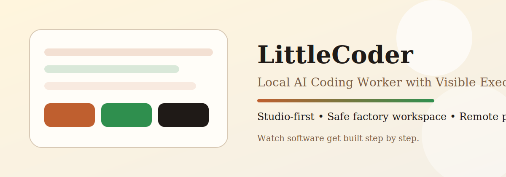

# LittleCoder v0.1.0




Local AI Coding Worker with Visible Execution.

Studio-first architecture.
Sandboxed factory workspace.
Remote execution streaming.

If this project helps you, star the repo and share it. That genuinely helps LittleCoder get discovered.

## Overview

LittleCoder is a local AI coding worker designed to make AI development understandable and visible.

Core ideas:
- Studio is the primary interface
- Factory workspace protects the system
- Visual execution shows what the worker is doing
- Remote channels narrate execution progress

## What Makes It Different

LittleCoder is not trying to be an agent platform.

It is a focused product:
- one Worker
- one queue
- one safe factory workspace
- one visible Studio experience

That constraint is the point. It keeps the product understandable, stable, and easy to trust.

## Why LittleCoder

Most AI coding tools feel invisible. You send a prompt and wait.

LittleCoder is built around a different promise:
- you can see the worker think through the task
- you can watch files appear in a safe factory workspace
- you can follow terminal output live
- you can still control the worker remotely when needed

The goal is simple: make AI software creation understandable, visible, and trustworthy.

## Quick Start

From the project folder:

```powershell
ollama serve
ollama pull qwen2.5-coder:7b-instruct-q4_K_M
npm install
npm run setup
npm start
```

Then in Studio, try:
- `create a simple website`
- `create a todo website`
- `create a personal portfolio`
- `create a calculator webpage`
- `create a landing page`

## Who It Is For

- makers who want a visible AI coding workflow
- developers who prefer local-first tools
- people who do not want black-box agent behavior
- anyone who wants to watch software being created step by step

## Installation

1. Install `Node.js`
2. Install `Ollama`
3. Start Ollama:

```powershell
ollama serve
```

4. Pull the default model:

```powershell
ollama pull qwen2.5-coder:7b-instruct-q4_K_M
```

5. Install LittleCoder dependencies:

```powershell
npm install
```

## Setup

Run the setup wizard:

```powershell
npm run setup
```

The setup page opens in your browser and asks for:
- your workspace folder
- your Ollama connection
- your model name
- your Studio port
- optional Telegram setup

You do not need to edit any config files by hand.

## Run

Start LittleCoder:

```powershell
npm start
```

If LittleCoder is not configured yet, the setup page opens automatically.

When startup completes, the console shows:
- `LittleCoder READY`
- your Studio URL
- Worker status
- channel status

Studio opens automatically in your browser.

## First Task

After Studio opens, try one of these:
- `create a simple website`
- `create a todo website`
- `create a personal portfolio`
- `create a calculator webpage`
- `create a landing page`

You can also submit the demo prompt from the terminal:

```powershell
npm run demo
```

## Optional Telegram

Telegram is optional. LittleCoder works fully through Studio even if Telegram is disabled.

If you want Telegram control, enable it during setup and enter:
- your Telegram bot token
- your owner Telegram chat ID

Remote channels receive narrated execution progress so you are never left wondering what the Worker is doing.

## Studio

Studio is the main control surface for LittleCoder.

Inside Studio you can:
- send tasks to the Worker
- watch files appear in the file tree
- see code appear in the editor
- watch terminal output live
- review recent task activity

## Project Status

LittleCoder is currently in `v0.1.0` MVP stage.

What is ready now:
- Studio-first task control
- local Ollama planning
- safe factory workspace isolation
- visible file and terminal execution
- optional Telegram control with narrated progress

What comes next:
- smoother onboarding polish
- stronger website generation quality
- better remote channel support

## Roadmap

See [ROADMAP.md](ROADMAP.md) for the short-term direction.

## FAQ

See [FAQ.md](FAQ.md) for common setup and product questions.

## Contributing

Contributions are welcome. If you want to help:
- open a bug report with reproduction steps
- suggest a product improvement
- send a pull request with a focused change

See [CONTRIBUTING.md](CONTRIBUTING.md) for the project guidelines.

## Security

If you find a security issue, please avoid posting secrets publicly in issues.

See [SECURITY.md](SECURITY.md) for the reporting process.

## Support

Need help getting started? See [SUPPORT.md](SUPPORT.md).
